# STIG Hardening, GPO Deployment, and SCC Compliance Scanning

   

This guide documents a complete, hands-on implementation of the DoD STIG hardening lifecycle on a Windows Server 2022 Active Directory environment — from baseline compliance scanning through GPO deployment to post-hardening verification. Every step was performed in a live lab and is backed by real SCC output showing the compliance score move from **43.86% (RED)** to **92.56%** after applying DISA STIGs via Group Policy.

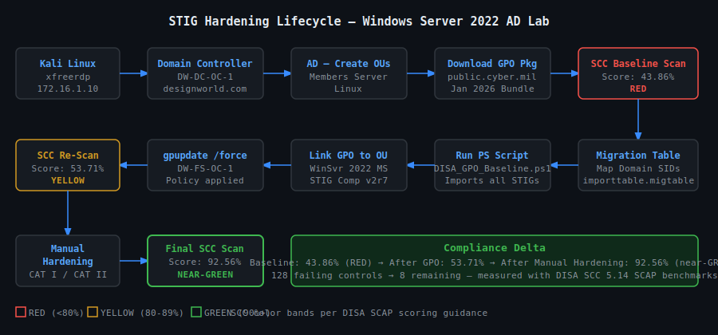

---

## Environment

| Component | Detail |
|---|---|
| Domain Controller | DW-DC-OC-1 — Windows Server 2022 Datacenter, domain: designworld.com |
| File Server | DW-FS-OC-1 — Windows Server 2022, domain-joined member server |
| Client | DW-CS9W-OC-1 — Windows 10/11 workstation |
| RDP Access | Kali Linux host via `xfreerdp` |
| GPO Package | U_STIG_GPO_Package_January_2026 (DISA, public.cyber.mil) |
| Compliance Tool | SCAP Compliance Checker (SCC) 5.14 — Windows bundle |

---

## Phase 1: RDP into the Domain Controller

From the Kali attack host, RDP into the DC using `xfreerdp`:

```bash
xfreerdp3 /u:Designworld\\Administrator /v:172.16.1.10 /cert:ignore /dynamic-resolution
```

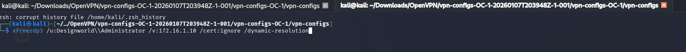

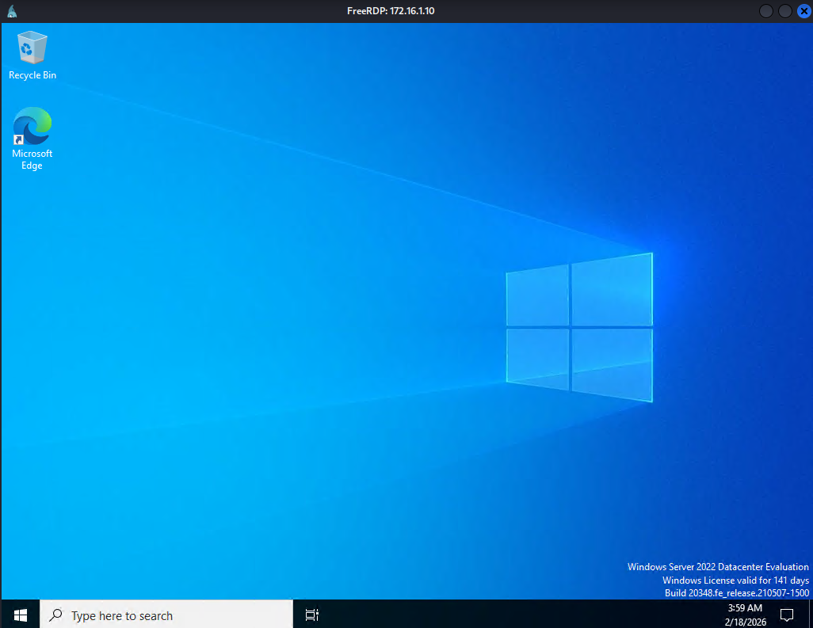

---

## Phase 2: Prepare Active Directory OUs

Before linking GPOs you need the right Organizational Unit (OU) structure so that STIG policies target only the correct machine class — you do not want to apply a member-server STIG to Domain Controllers.

**Open Group Policy Management** (Start → `gpmc.msc`):

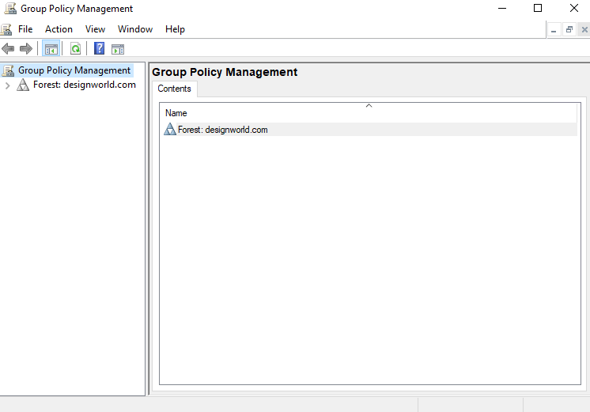

**Open Active Directory Users and Computers** side by side (`dsa.msc`). Confirm computers are visible under the domain:

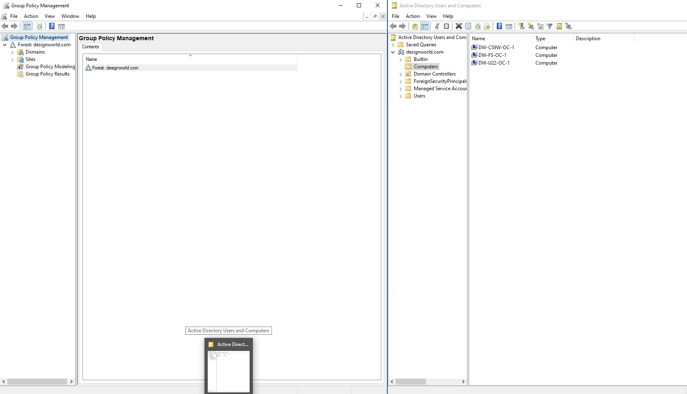

**Create new OUs** — right-click the domain root → New → Organizational Unit. Create:
- `Members Server` — for domain-joined Windows servers
- `Linux` — for Linux hosts (future scope)

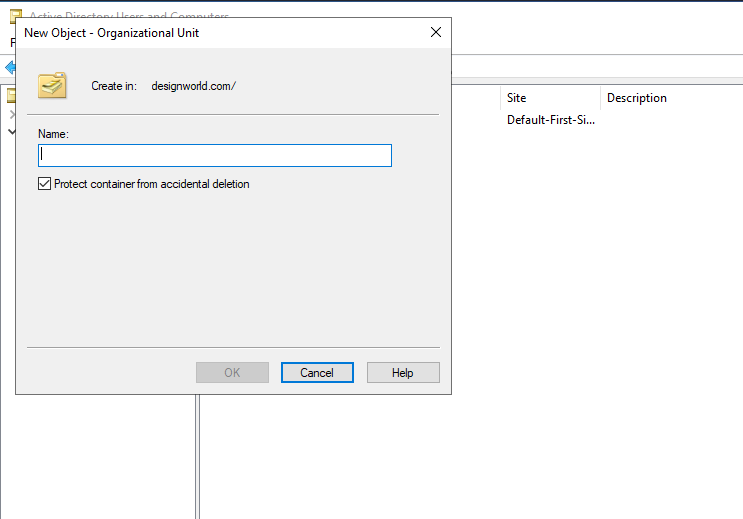

Move the member server computer objects (`DW-FS-OC-1`) into the `Members Server` OU:

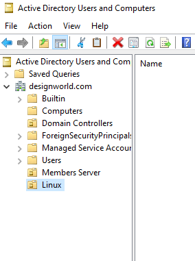

---

## Phase 3: Download the DISA STIG GPO Package

Navigate to **public.cyber.mil** → SCAP & Tools → GPO Downloader. Download the latest **Group Policy Objects (GPOs)** package (January 2026 bundle used here):

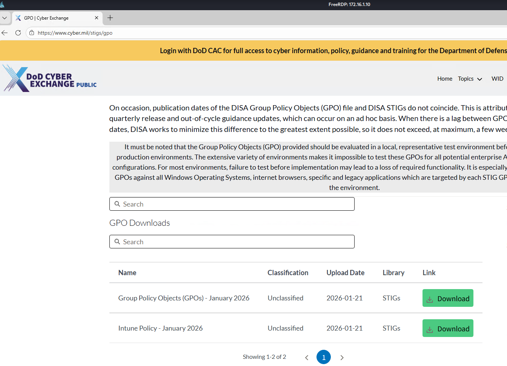

The package contains pre-built GPOs for every DoD-approved STIG — Windows Server 2022, Windows 10/11, Office 365, Edge, Chrome, IIS, SQL, Defender, and more.

---

## Phase 4: Run a Baseline SCC Scan (Before Hardening)

Before touching any policy, establish a baseline so you can measure your improvement.

**Install and launch SCC 5.14.** When it opens you may see a warning about unanswered manual questions — this is normal and expected. These are checks that require human judgment (e.g., physical security controls) and cannot be automated:

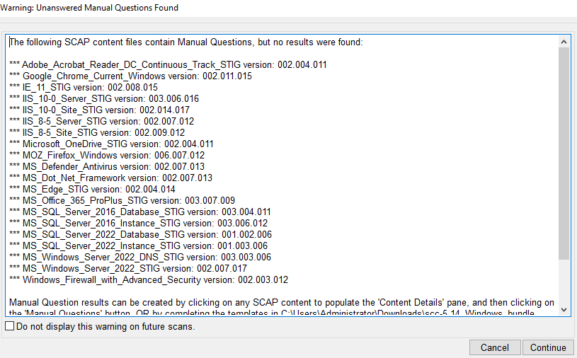

Select **Local Scan**, choose the Windows Server 2022 SCAP content, and scan the DC. SCC will validate digital signatures on every benchmark XML before scanning.

**Baseline result — Domain Controller (DW-DC-OC-1):**

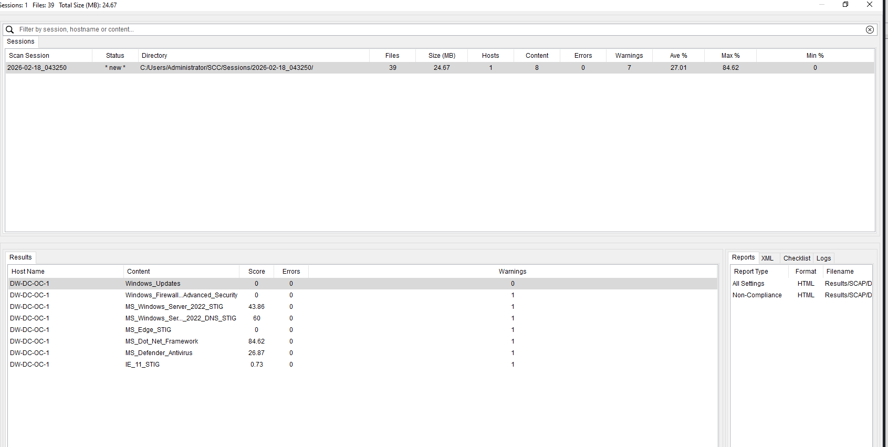

Open the **Non-Compliance Report** (HTML format) for a full breakdown:

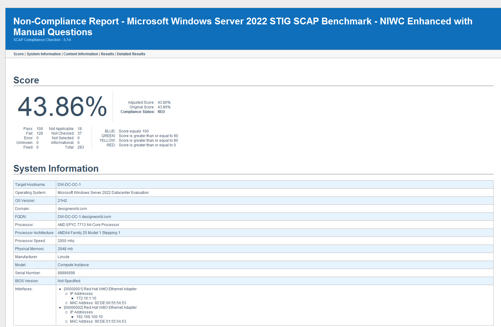

| Metric | Baseline |
|---|---|
| Overall Score | **43.86% — RED** |
| Pass | 100 |
| Fail | 128 |
| Not Checked | 37 |
| Total Controls | 283 |

A RED score means the system is far from DoD compliance requirements. The 128 failures are the hardening work ahead.

---

## Phase 5: Configure the Migration Table

The DISA GPO package includes a **Migration Table** that maps security principals from the DISA lab environment to your domain. You must update it before importing.

In the GPO package's `Support Files` directory, run `importtable.migtable` **as Administrator**:

```cmd
cd C:\Users\Administrator\Downloads\U_STIG_GPO_Package_January_2026\Support Files
run importtable.migtable
```

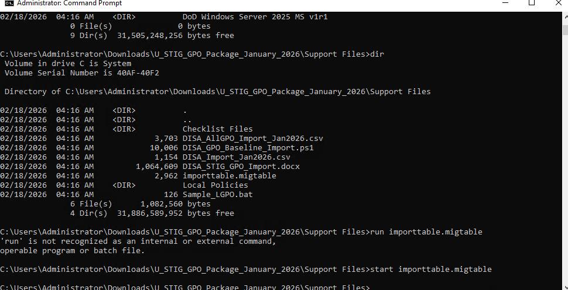

The Migration Table Editor opens. Add your domain's **Domain Admins** and **Enterprise Admins** accounts (e.g., `Domain Admins@designworld.com`, `Enterprise Admins@designworld.com`) to the Destination Name column:

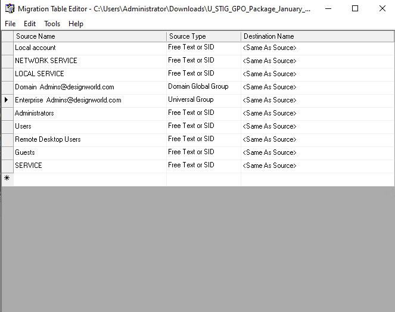

Save and close.

---

## Phase 6: Configure and Run the GPO Import Script

The package includes `DISA_AllGPO_Import_Jan2026.csv` — a CSV that maps every STIG GPO name to its source folder path. Open it in Notepad and update the file path prefix to match where you extracted the package on your system:

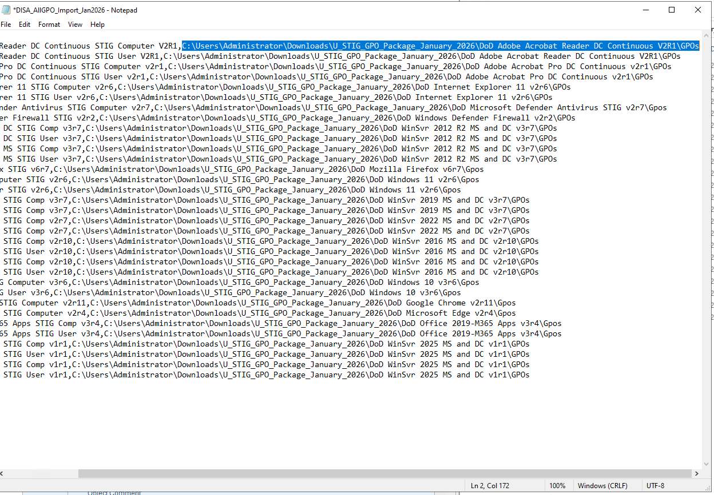

The CSV maps entries for every STIG — WinSvr 2012 R2 through 2025, Windows 10/11, Adobe Acrobat, Chrome, Firefox, Edge, IIS, SQL Server, Office 365, Defender, and more.

Next, open `DISA_GPO_Baseline.ps1` in **PowerShell ISE** as Administrator. This script reads the CSV and bulk-imports all GPOs into Group Policy Management:

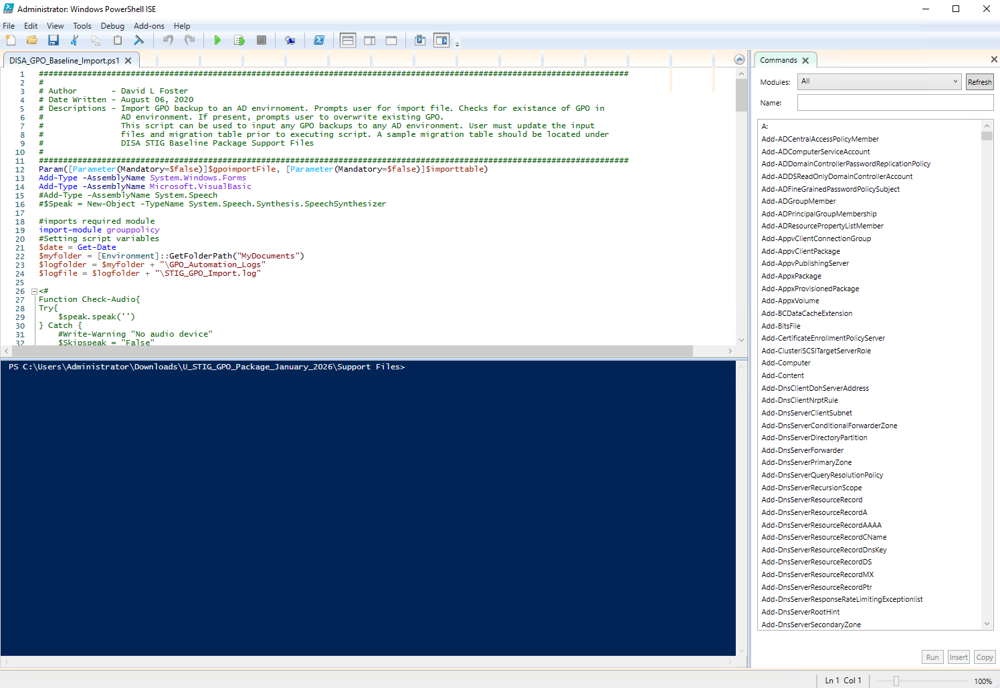

Run the script. The output pane will show each GPO being created and linked:

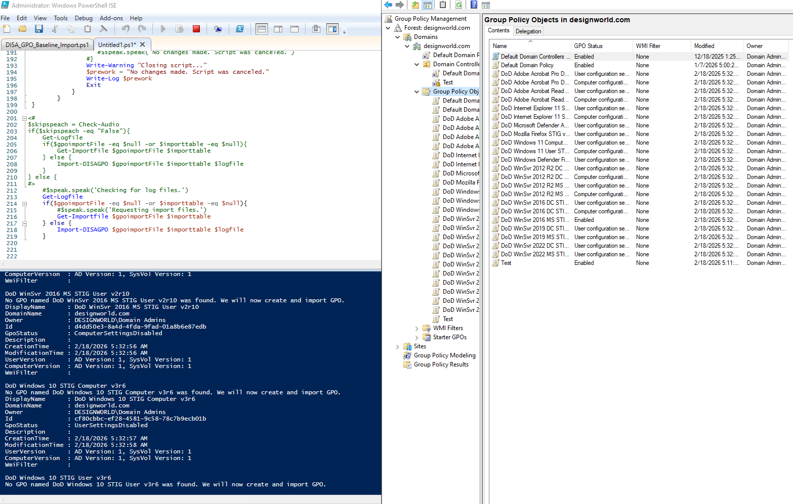

After completion, Group Policy Management will contain the full DISA STIG GPO library — Windows Server 2012 R2 through 2025, client OS STIGs, and all application STIGs.

---

## Phase 7: Link the STIG GPO to the Members Server OU

The GPOs have been imported but not yet applied. Link the correct GPO to the `Members Server` OU:

1. In GPMC, right-click `Members Server` → **Link an Existing GPO**
2. Select `DoD WinSvr 2022 MS STIG Comp v2r7` (MS = Member Server, DC variant is separate)

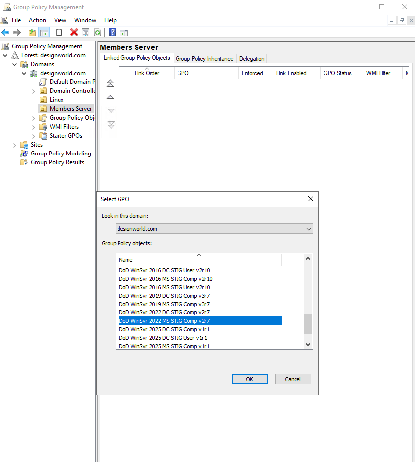

After linking, the OU shows all active GPO links. The Members Server OU received 6 GPOs covering the OS, applications, and security baselines:

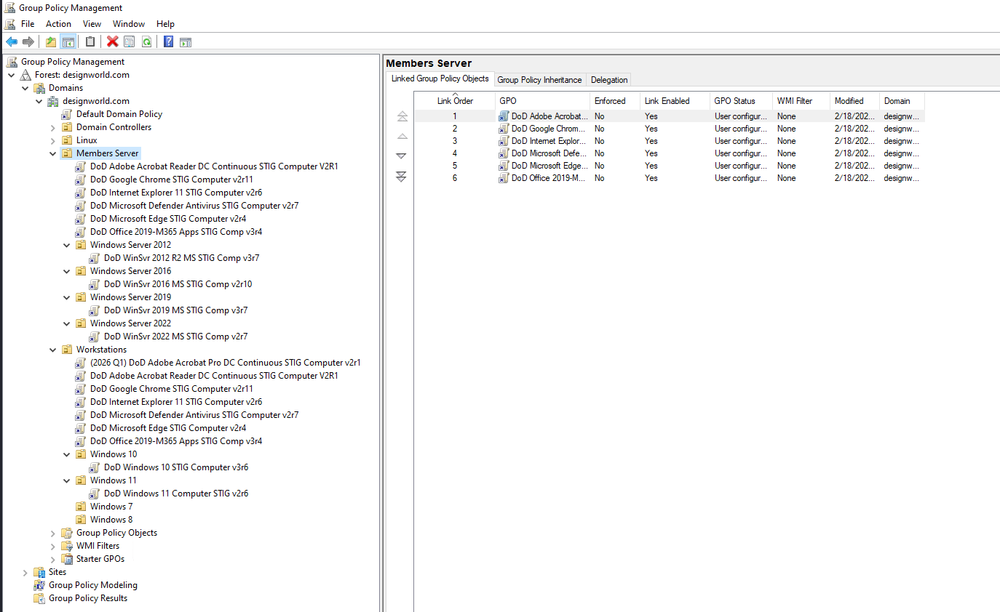

---

## Phase 8: Force Group Policy Application

On the target member server (`DW-FS-OC-1`), force an immediate policy refresh rather than waiting for the background refresh interval:

```cmd
gpupdate /force
```

The output confirms which GPOs were applied and which were filtered out based on security group membership:

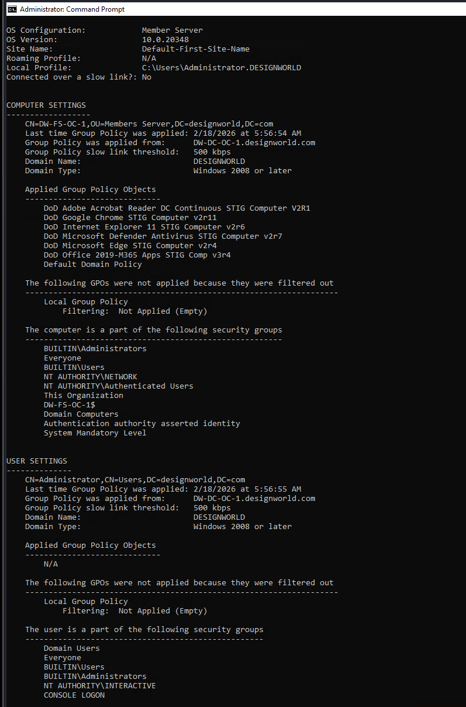

Key lines to verify: `Applied Group Policy Objects` should include the STIG GPOs you linked. `The following GPOs were not applied because they were filtered out` is normal — these are GPOs targeting other OS versions or user vs. computer policy.

---

## Phase 9: Re-scan with SCC After GPO Application (Post-Hardening)

Run SCC again — this time as a **Windows Single Remote Scan** targeting the file server (172.16.1.20) via WMI:

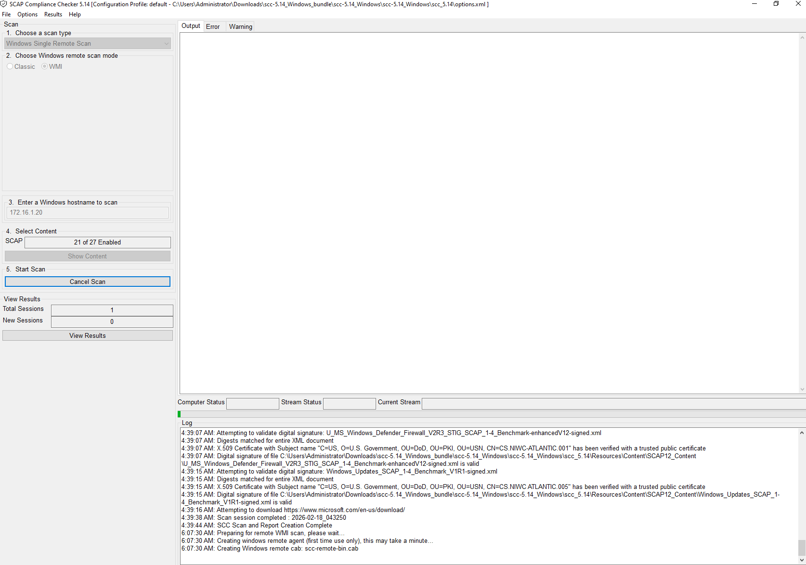

**First post-GPO scan — File Server (DW-FS-OC-1):**

Session comparison shows the score jump from the pre-GPO baseline:

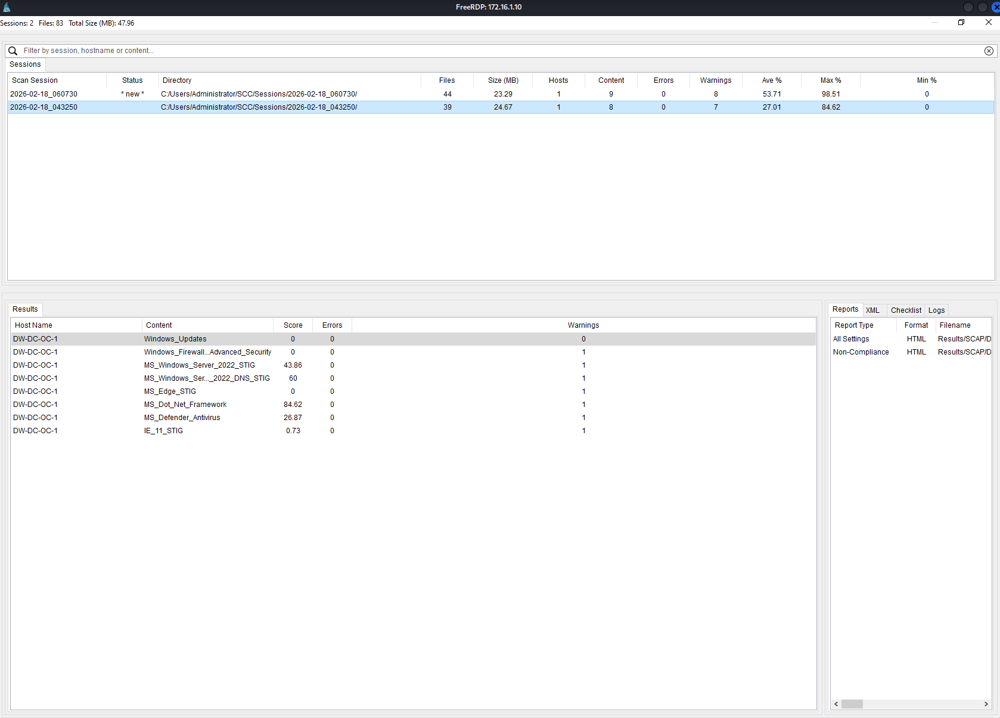

| Session | Avg % |
|---|---|
| Baseline (before GPO) | 27.01% |
| After GPO application | 53.71% |

Detailed results by STIG content:

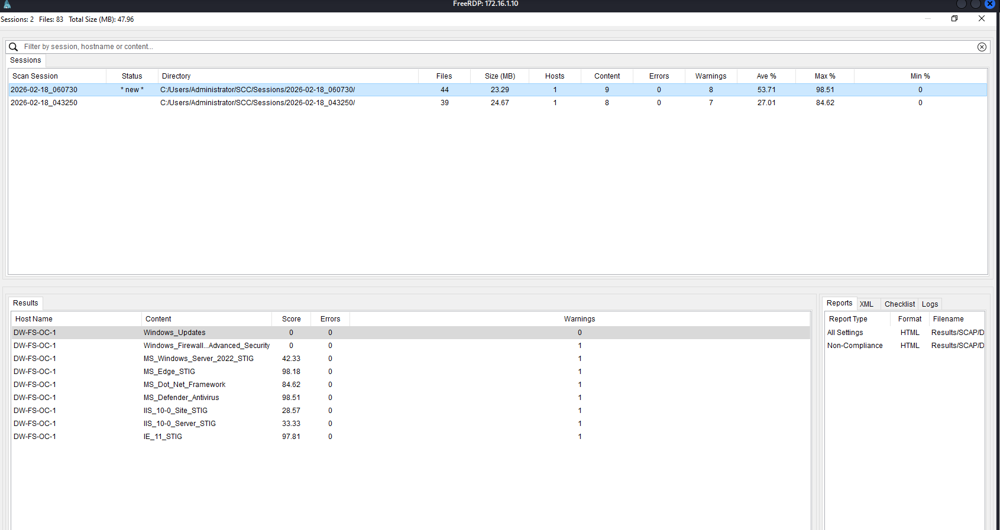

| STIG Content | Score |
|---|---|
| MS_Windows_Server_2022_STIG | 42.33% |
| MS_Edge_STIG | 98.18% |
| MS_Dot_Net_Framework | 84.62% |
| MS_Defender_Antivirus | 98.51% |
| IIS_10-0_Site_STIG | 28.57% |
| IIS_10-0_Server_STIG | 33.33% |

---

## Phase 10: Additional Manual Hardening and Final Scan

Beyond what GPOs can automate, some STIG controls require manual configuration — registry tweaks, service disablement, audit policy tuning, and IIS-specific hardening. After applying those additional controls and re-scanning:

**Final scan results — File Server:**

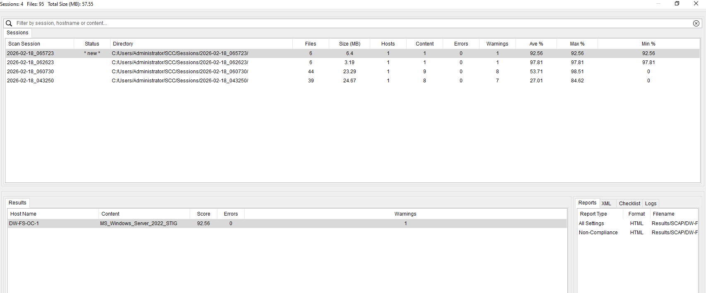

| Session | MS_WinSvr_2022_STIG Score |
|---|---|
| Baseline | 27.01% |
| After DISA GPO | 53.71% |
| After manual hardening | **92.56% — near GREEN** |

The file server went from RED at 27% to near-GREEN at 92.56% on the Windows Server 2022 STIG benchmark. The remaining ~7.5% represents controls that require organizational decisions (CAC enforcement, specific DoD CA certificate chains, site-specific network configuration) rather than individual system hardening.

---

## Hardening Workflow Summary

```
1. RDP into DC
        |
2. Create OUs in AD (Members Server, Linux)
        |
3. Download DISA STIG GPO Package (public.cyber.mil)
        |
4. Run SCC Baseline Scan → document starting score (RED)
        |
5. Configure Migration Table (add domain admin accounts)
        |
6. Edit DISA_AllGPO_Import CSV (set correct file path)
        |
7. Run DISA_GPO_Baseline.ps1 → imports all DISA STIGs into GPMC
        |
8. Link "DoD WinSvr 2022 MS STIG Comp" GPO to Members Server OU
        |
9. Run gpupdate /force on target servers
        |
10. Re-scan with SCC → measure improvement
        |
11. Manual hardening for remaining controls → final scan → GREEN
```

---

## Key Files in the DISA GPO Package

| File | Purpose |
|---|---|
| `DISA_AllGPO_Import_Jan2026.csv` | Maps every STIG GPO name to its source folder |
| `DISA_GPO_Baseline.ps1` | PowerShell script that bulk-imports GPOs from the CSV |
| `importtable.migtable` | Migration Table Editor — maps SIDs from DISA lab to your domain |
| `DISA_STIG_GPO_Import.docx` | Official DISA import instructions |
| `Sample_LGPO.bat` | Local GPO import for non-domain systems |

---

## What I Learned / Skills Demonstrated

**Compliance frameworks and tooling**
- How DISA STIGs are structured (STIG ID, V-ID, severity categories CAT I/II/III), how SCAP benchmarks encode them as machine-checkable rules, and how SCC executes SCAP content against live systems remotely via WMI — not just running a scan tool, but understanding what the output means.
- The difference between a STIG *benchmark* (the requirement) and a STIG *GPO* (one automated implementation approach) — and why the GPO alone never gets you to 100%: some controls are manual checks (physical security, configuration that GPO cannot express), organizational decisions (which CAs to trust), or require site-specific values.

**Group Policy and Active Directory**
- Designing OU structure to scope GPO application correctly — Member Server GPOs and Domain Controller GPOs are separate STIG packages because the security requirements differ. Applying the wrong GPO to the wrong OU breaks things.
- Using the DISA Migration Table to translate security principal references from DISA's test environment into your domain's actual SIDs — skipping this step causes GPO import failures.
- Reading `gpresult` and `gpupdate` output to confirm which policies actually applied versus were filtered, and why filtering is normal and expected.

**Measuring and demonstrating improvement**
- Running SCC baseline scans *before* hardening so there is a documented before/after delta — a 43.86% → 92.56% improvement is a concrete result that can be shown in an audit or to a customer.
- Reading the Non-Compliance HTML report to prioritize remediation: CAT I findings (highest severity) first, then CAT II, then CAT III.
- Understanding that the remaining gap after GPO deployment (the ~7-8% that doesn't move) tells you where manual effort is needed — it is actionable, not just noise.

**Problem solved:** took a default Windows Server 2022 installation from 27% STIG compliance (RED) to 92.56% (near-GREEN) by combining the DISA GPO bulk-import workflow with targeted manual hardening, and used SCC scans at each stage to quantify the improvement — exactly the audit-evidence workflow required in DoD, federal, and regulated enterprise environments.

---

## License

This guide is licensed under the MIT License. See [LICENSE](./LICENSE) for details.
